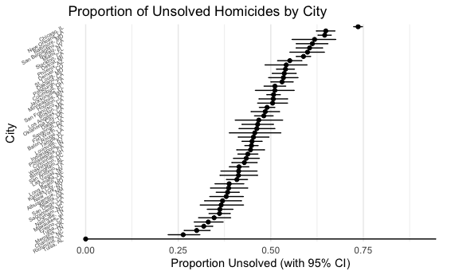

p8105_hw5_rl3610
================
Ruohan Lyu
2025-11-11

# Problem 1

### Create a funtion

``` r
bday_sim = function(n_room) {
  
  birthdays = sample(1:365, n_room, replace = TRUE)

  repeated_bday = length(unique(birthdays)) < n_room

  repeated_bday
  
}
```

### Simulation

``` r
bday_sim_results = 
  expand_grid(
    bdays = 2:50, 
    iter = 1:10000
  ) |> 
  mutate(
    result = map_lgl(bdays, bday_sim)
  ) |> 
  group_by(
    bdays
  ) |> 
  summarize(
    prob_repeat = mean(result)
  )
```

### Make the plot

``` r
bday_sim_results |> 
  ggplot(aes(x = bdays, y = prob_repeat)) + 
  geom_point() + 
  geom_line() +
  labs(
    title = "Probability of Shared Birthday by Group Size",
    x = "Group Size",
    y = "Probability of Shared Birthday",
    caption = "Based on 10,000 simulations per group size"
  ) +
  scale_y_continuous(labels = scales::percent_format()) +
  theme_minimal()
```


The plot shows that the probability of shared birthday rises quickly as
the number of people in the room increases. When the group size is
small(fewer than 10 people), the probability of a shared birthday is
very low. Around a group size of 23, the probability reaches about 50%,
and by the time the group reaches around 50 people, the probability is
close to 100%.

# Problem 2

### Create a funtion

``` r
t_test_sim = function(mu) {

  x = rnorm(n = 30, mean = mu, sd = 5)

  test_result = t.test(x, mu = 0)
  
  tidy_results = broom::tidy(test_result)
  
  tibble(
    mu_hat = pull(tidy_results, estimate),
    p_value = pull(tidy_results, p.value)
  )
  
}
```

### Simulation

``` r
power_sim_results_df = 
  expand_grid(
    true_mu = c(0:6),
    iter = 1:5000
  ) |> 
  mutate(
    results = map(true_mu, t_test_sim)
  ) |> 
  unnest(results) |> 
  mutate(
    reject_null = p_value < 0.05
  )
```

### Plot 1: Power vs. Effect Size

``` r
power1_summary_df = 
  power_sim_results_df |> 
  group_by(true_mu) |> 
  summarize(
    power = mean(reject_null)
  )

power1_summary_df |> 
  ggplot(aes(x = true_mu, y = power)) + 
  geom_point() + 
  geom_line() +
  labs(
    title = "Statistical Power vs. Effect Size",
    x = "True Effect Size (μ)",
    y = "Power (Probability of Rejecting H0)",
    caption = "n = 30, σ = 5, α = 0.05, 5000 simulations per effect size"
  ) +
  scale_y_continuous(labels = scales::percent_format()) +
  theme_minimal()
```


``` r
power1_summary_df
```

    ## # A tibble: 7 × 2
    ##   true_mu  power
    ##     <int>  <dbl>
    ## 1       0 0.0524
    ## 2       1 0.192 
    ## 3       2 0.558 
    ## 4       3 0.887 
    ## 5       4 0.988 
    ## 6       5 0.999 
    ## 7       6 1

The simulation results demonstrate a strong positive association between
effect size and statistical power. As μ increases, the power of the
t-test rises dramatically from approximately 5% to nearly 100%, showing
that larger effect sizes are detected with substantially higher
probability given a sample size of 30.

### Plot 2: Average Estimates vs. True Effect Size

``` r
power2_summary_df = 
  power_sim_results_df |> 
  group_by(true_mu) |> 
  summarize(
    avg_mu_hat = mean(mu_hat),
    avg_mu_hat_rejected = mean(mu_hat[reject_null])
  )

power2_summary_df |> 
  select(true_mu, avg_mu_hat, avg_mu_hat_rejected) |> 
  pivot_longer(
    cols = c(avg_mu_hat, avg_mu_hat_rejected),
    names_to = "estimate_type",
    values_to = "mean_estimate"
  ) |> 
  mutate(
    estimate_type = case_when(
      estimate_type == "avg_mu_hat" ~ "All Samples",
      estimate_type == "avg_mu_hat_rejected" ~ "Only When H0 Rejected"
    )
  ) |> 
  ggplot(aes(x = true_mu, y = mean_estimate, color = estimate_type)) + 
  geom_point() + 
  geom_line() +
  geom_abline(slope = 1, intercept = 0, linetype = "dashed", alpha = 0.5) +
  labs(
    title = "Average Estimates vs. True Effect Size",
    x = "True Effect Size (μ)",
    y = "Average Estimate (μ̂)",
    color = "Sample Type",
    caption = "Dashed line represents perfect estimation (y = x)"
  ) +
  theme_minimal()
```


``` r
power2_summary_df
```

    ## # A tibble: 7 × 3
    ##   true_mu avg_mu_hat avg_mu_hat_rejected
    ##     <int>      <dbl>               <dbl>
    ## 1       0     0.0163               0.123
    ## 2       1     1.01                 2.30 
    ## 3       2     1.99                 2.61 
    ## 4       3     3.00                 3.20 
    ## 5       4     4.01                 4.04 
    ## 6       5     5.01                 5.02 
    ## 7       6     5.99                 5.99

No, the sample average of μ̂ across tests for which the null is rejected
is not approximately equal to the true value of μ, especially for small
effects. This overestimation occurs because we only reject the null
hypothesis when sampling variation produces unusually large estimates.
The bias diminishes for larger true effects, where significance is
almost guaranteed.

# Problem 3

### Import and describe the raw data

``` r
homicides_df = 
  read_csv("data/homicide-data.csv", na = c("NA",".","")) |> 
  janitor::clean_names() 
```

    ## Rows: 52179 Columns: 12
    ## ── Column specification ────────────────────────────────────────────────────────
    ## Delimiter: ","
    ## chr (9): uid, victim_last, victim_first, victim_race, victim_age, victim_sex...
    ## dbl (3): reported_date, lat, lon
    ## 
    ## ℹ Use `spec()` to retrieve the full column specification for this data.
    ## ℹ Specify the column types or set `show_col_types = FALSE` to quiet this message.

The raw dataset contains 52179 homicide records from 50 large U.S.
cities, with 12 variables including victim demographics (race, age,
sex), geographic information (city, state, latitude, longitude), case
details (uid, report date), and disposition status indicating whether
cases were closed by arrest, closed without arrest, or remain open.

### Total number of homicides and the number of unsolved homicides

``` r
city_summary = 
  homicides_df |> 
  mutate(
    city_state = str_c(city, ", ", state)
  ) |> 
  group_by(city_state) |> 
  summarize(
    total_homicides = n(),
    unsolved_homicides = sum(disposition %in% c("Closed without arrest", "Open/No arrest"))
  ) |>
  ungroup()
```

### prop.test function

``` r
prop_test = function(city_state_name) {
  
  target_city =
    city_summary |>
    filter(city_state == city_state_name)
  
  test_result = 
    prop.test(
      x = pull(target_city, unsolved_homicides),
      n = pull(target_city, total_homicides)
    )
  
  broom::tidy(test_result) |> 
    select(estimate, conf.low, conf.high)
}
```

### prop.test for Baltimore

``` r
prop_test("Baltimore, MD")
```

    ## # A tibble: 1 × 3
    ##   estimate conf.low conf.high
    ##      <dbl>    <dbl>     <dbl>
    ## 1    0.646    0.628     0.663

### prop.test for all cities

``` r
all_cities_results = 
  city_summary |> 
  mutate(
    prop_test_result = map2(unsolved_homicides, total_homicides, 
                    ~prop.test(.x, .y)),
    prop_test_tidy = map(prop_test_result, broom::tidy)
  ) |> 
  unnest(prop_test_tidy) |> 
  select(
    city_state, estimate, conf.low, conf.high
  )

all_cities_results |> 
  head(10) |> 
  knitr::kable(digits = 3)
```

| city_state      | estimate | conf.low | conf.high |
|:----------------|---------:|---------:|----------:|
| Albuquerque, NM |    0.386 |    0.337 |     0.438 |
| Atlanta, GA     |    0.383 |    0.353 |     0.415 |
| Baltimore, MD   |    0.646 |    0.628 |     0.663 |
| Baton Rouge, LA |    0.462 |    0.414 |     0.511 |
| Birmingham, AL  |    0.434 |    0.399 |     0.469 |
| Boston, MA      |    0.505 |    0.465 |     0.545 |
| Buffalo, NY     |    0.612 |    0.569 |     0.654 |
| Charlotte, NC   |    0.300 |    0.266 |     0.336 |
| Chicago, IL     |    0.736 |    0.724 |     0.747 |
| Cincinnati, OH  |    0.445 |    0.408 |     0.483 |

### Create a plot

``` r
city_plot =
  all_cities_results |>
  mutate(
    city_state = fct_reorder(city_state, estimate)
  ) |>
  ggplot(aes(x = estimate, y = city_state)) +
  geom_point() +
  geom_errorbar(aes(xmin = conf.low, xmax = conf.high), width = 0.2) +
  labs(
    title = "Proportion of Unsolved Homicides by City",
    x = "Proportion Unsolved (with 95% CI)",
    y = "City"
  ) +
  theme_minimal() + 
  theme(
    axis.text.y = element_text(size = 5, angle = 30),
    panel.grid.major.y = element_blank()
  )

city_plot
```


